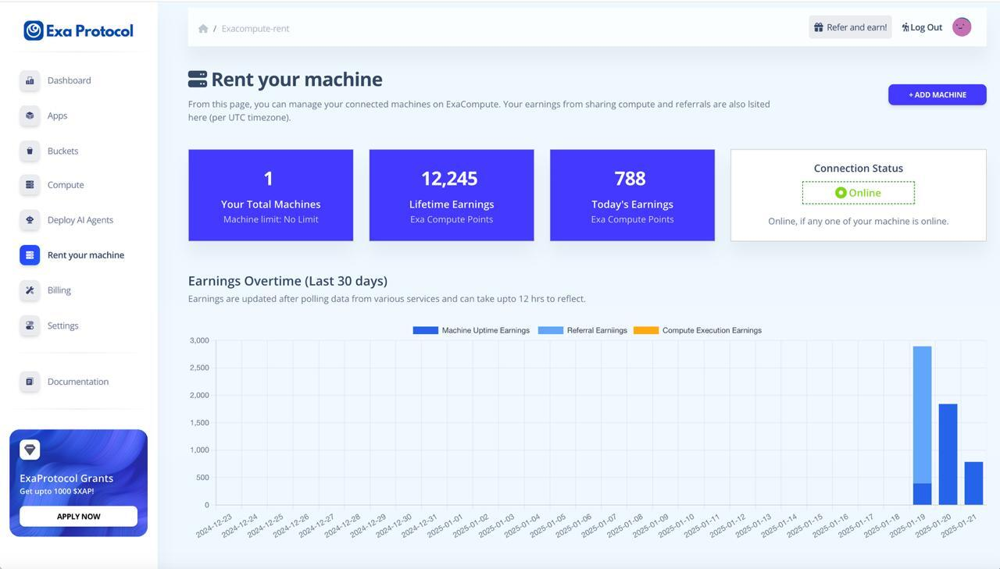

# Introduction

<figure><figcaption>
ExaCompute Dashboard
</figcaption></figure>

### Introduction

ExaCompute by Exa Protocol, is a decentralized cloud compute platform that allows users to rent out their machines and participate in a decentralized cloud network. This breakthrough solution provides a secure, scalable, and cost-efficient alternative to traditional cloud computing services, empowering enterprises and individuals to leverage distributed computing resources and move to a truly decentralized cloud for their blockchain apps. With ExaCompute, users can run decentralized virtual machines (VMs), customize configurations, deploy AI agents and execute tasks such as AI processing, machine learning, and other compute-intensive operations.

### Key Features of ExaCompute

### 1. **Decentralized Virtual Machines (VMs)**

* Run VMs securely via SSH access on a decentralized network of machines rented out by owners/hosts spread across the globe.
* Customize VM configurations to suit specific workloads.
* Execute tasks such as AI training, data analysis, and machine learning.

### 2. **Scalability & Low Latency**

* Leverage the power of distributed nodes to scale operations seamlessly.
* Access a global network of compute resources without relying on centralized infrastructure.
* With a global network, experience almost zero latency similar to web2 applications.

### 3. **Cost Efficiency**

* Reduce costs by utilizing the underutilized computing resources from the network.
* Avoid the high pricing models of traditional cloud providers.

### 4. **Security**

* Benefit from the decentralized architecture that eliminates single points of failure.
* Ensure data integrity with encrypted communication and redundant storage.

### 5. **Transparency**

* Transparent pricing models with no hidden fees.
* Full visibility into resource usage and costs.

### How It Works

1. **For Providers**:
   * Rent out unused computing resources (e.g., CPUs, GPUs) by joining the ExaCompute network.
   * Earn rewards for contributing compute power to the decentralized cloud.
2. **For Consumers**:
   * Deploy workloads on distributed VMs.
   * Pay only for the resources you use, with flexible pricing based on demand.
3. **Decentralized Network**:
   * The network operates on a peer-to-peer basis, ensuring high availability and fault tolerance.
   * Tasks are distributed across multiple nodes for efficiency and reliability.

### Use Cases

* **AI & Machine Learning**: Train models using distributed GPU resources at lower costs.
* **Data Processing**: Perform large-scale data analysis without investing in expensive infrastructure.
* **Web3 Applications**: Host decentralized applications requiring scalable compute power.
* **Rendering & Simulations**: Run complex simulations or render graphics-heavy workloads efficiently.

### Getting Started with ExaCompute

1. **Sign Up**:
   * Create an account on the ExaCompute platform.
2. **Set Up Resources**:
   * For providers: Configure your machine to contribute compute power to the network.
   * For consumers: Select your desired VM configuration and deploy workloads.
3. **Manage Tasks**:
   * Monitor resource usage and task progress via the intuitive dashboard.
4. **Secure Access**:
   * Connect securely to your VMs using SSH for full control over your deployments.

ExaCompute represents a significant step forward in decentralized cloud computing, offering a flexible, secure, and cost-effective alternative to centralized solutions. Whether you're an enterprise looking to optimize costs or an individual seeking scalable compute power, ExaCompute provides the tools you need to succeed in today's digital landscape.ShareRewrite\
